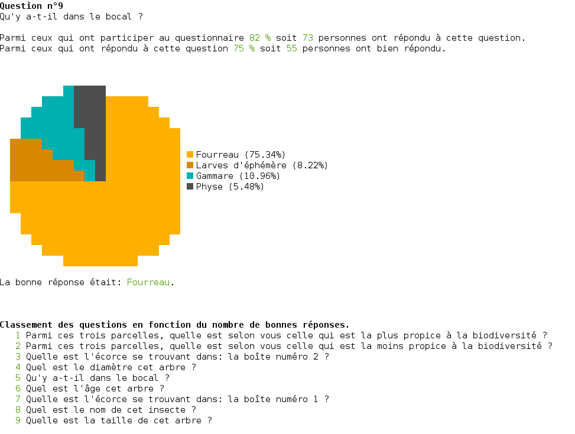

# Atelier Scientifique 2016

An application to use at an open doors.

## Commands

### Install

```
$ npm install
```

### Run

```
$ npm start
```

### Build the app

```
$ npm run build
```

### Get advanced statistics

```
$ npm run stats
```

## Results



